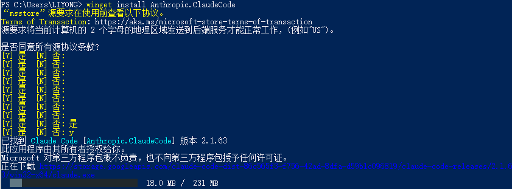
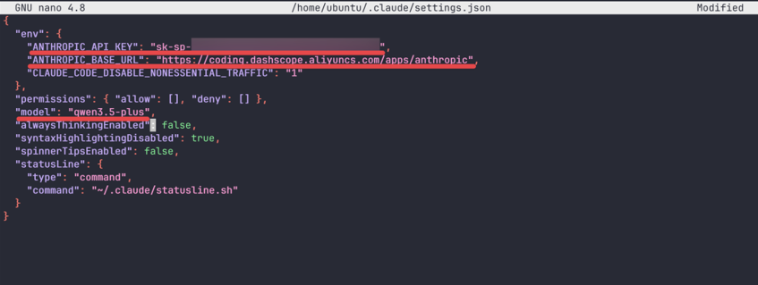
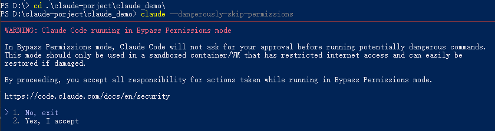
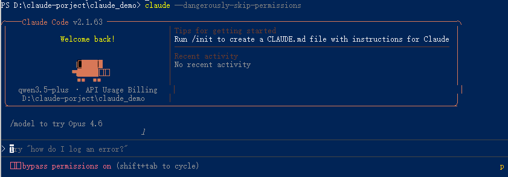
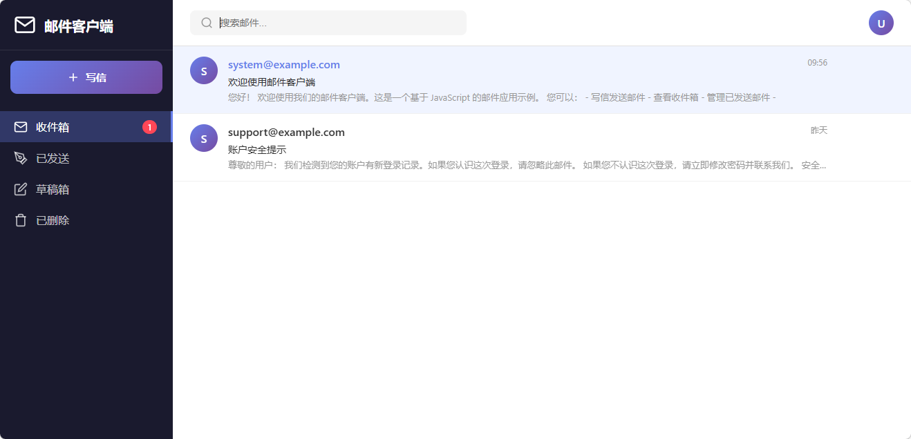

# Claude Code

## 一、环境搭建与基础使用

官网地址：[Claude Code by Anthropic | AI Coding Agent, Terminal, IDE](https://claude.com/product/claude-code)

文档：[Claude Code overview - Claude Code Docs](https://code.claude.com/docs/en/overview)

### 1.1 安装 Claude Code

**Mac/Linux/WSL 运行：**

```bash
curl -fsSL https://claude.ai/install.sh | bash
```

Windows 10 用户在 PowerShell 里运行：

```powershell
irm https://claude.ai/install.ps1 | iex
```

Windows 11 及以上

```powershell
winget install Anthropic.ClaudeCode
```

**安装过程**



**安装后验证**


### 1.2 配置环境变量

先创建配置文件。

Mac/Linux 用户：

```bash
mkdir -p ~/.claude
nano ~/.claude/settings.json
```

**`YOUR_API_KEY` 换成上面那个 Coding Plan 的 Key.**

`ANTHROPIC_MODEL` 可以换成 Coding Plan 支持的任意模型，比如 `glm-5`、`MiniMax-M2.5`、`kimi-k2.5` 等。

```json
{
    "env": {
        "ANTHROPIC_AUTH_TOKEN": "YOUR_API_KEY",
        "ANTHROPIC_BASE_URL": "https://coding.dashscope.aliyuncs.com/apps/anthropic",
        "ANTHROPIC_MODEL": "qwen3.5-plus"
    }
}
```



Windows 用户在 CMD 里运行：

```cmd
setx ANTHROPIC_AUTH_TOKEN "YOUR_API_KEY"
setx ANTHROPIC_BASE_URL "https://coding.dashscope.aliyuncs.com/apps/anthropic"
setx ANTHROPIC_MODEL "qwen3.5-plus"
```

### 1.3 基础使用

启动 claude code

**直接启动**,在项目目录下直接运行：claude

**跳过所有权限检测**: claude --dangerously-skip-permissions





此时会多一个模式：bypass permissions on (shift+tab to cycle)

**继续上一个对话**: claude -c

#### **1.3.1 demo 实例**

生成面一个发邮件功能，采用 html 实现


创建时有三个选项

1. Yse 表示单授权，只创建 email-client.html 文件，后续每次创建文件时都会询问
2. Yes,allow all edites during this aession(shift+tab) 表示当前会话授权，后续创建文件会自动通过，不会再次询问
3. No 表示不同意，可以继续输入自己的想法，claude code 会根据你的想法再次生成代码并再次询问

这里选择 Yse 选择，效果如下：



#### **1.3.2 claude code 三种模式**(默认/自动/规划)，切换：shift + tab

1. 默认模式（？for shortcuts）：每执行时都会询问
2. 自动同意模式（accept edits on (shift+tab to cycle)）：执行不询问直接执行
3. 规划模式 (plan mode on (shift+tab to cycle))：只探讨复杂的方案，不执行具体的动作

#### **1.3.3 claude code 打开生成文件命令**:

进入 claude code 后输入！进行命令模式，

##### 1.3.3.1 Mac 打开文件 open 命令:

```bash
! open email-client.html
```

##### 1.3.3.2 linux 打开文件：

```bash
# 通用方式（大部分桌面版 Linux 支持）
! xdg-open 文件名

# 示例：打开 test.py 文件
! xdg-open test.py

# 打开当前文件夹
! xdg-open .

# 如果 xdg-open 不可用，尝试发行版专属命令：
# Ubuntu/Debian 系
! gnome-open 文件名
# KDE 系
! kde-open 文件名
```

##### 1.3.3.3 windows 打开文件：

```cmd
# 打开文件（会用系统默认程序打开）
! start 文件名

# 示例：打开当前目录下的 test.py 文件
! start test.py

# 打开文件夹（打开当前目录）
! start .

# 打开指定文件夹
! start C:\Users\你的用户名\Documents
```

#### 1.3.4 规划模式

通过规划重构以一上邮件功能，以上邮件功能所有内容都在一个 html 中实现的，这明显不是我们需要的，

> 将当前的邮件功能重构，使用 React + Typescript + vite 技术重构，你保留现在的所有功能，且 Ui 风格保持一致

 生成的重构规划：

```
Here is Claude's plan:

邮件客户端重构计划：React + TypeScript + Vite

Context

重构原因：
当前邮件客户端使用单文件 HTML + 原生 JavaScript 实现，存在以下问题：
- 代码难以维护和扩展
- 没有类型安全
- UI 和业务逻辑耦合严重
- 无法复用组件

目标：
将 email-client.html 重构为现代化的 React + TypeScript + Vite
项目，保持现有功能的同时提升代码质量和可维护性。

预期结果：
- 模块化组件架构
- TypeScript 类型安全
- 清晰的关注点分离
- 易于扩展和测试
```

#### 1.3.5 回滚

按两次 esc 选择回滚版本

#### 1.3.6 claude 接入 MCP

官网文档 [通过 MCP 将 Claude Code 连接到工具 - Claude Code Docs](https://code.claude.com/docs/zh-CN/mcp#安装-mcp-服务器)

**选项 1：添加远程 HTTP 服务器**

```bash
# 基本语法
claude mcp add --transport http <name> <url>

# 真实示例：连接到 Notion
claude mcp add --transport http notion https://mcp.notion.com/mcp
```

**选项 2：添加远程 SSE 服务器**

```bash
# 基本语法
claude mcp add --transport sse <name> <url>
```

**选项 3：添加本地 stdio 服务器**

```bash
# 基本语法
claude mcp add [options] <name> -- <command> [args...]
```

#### 1.3.7 回到最近的对话 (/resume)

```
/resume
```

#### 1.3.8 上下文压缩（/compact)

```
# 压缩命令
/compact
# 后面也可以跟压缩策略
/compact 重点保留用户的需求
```

#### 1.3.9 清空上下文 (/clear)

```
# 清空所有上下文
/clear
```

#### 1.3.10 claude 生成 CLAUDE.md 文件

```cmd
# 生成 CLAUDE.md 文件
> /init

# 打开 CLAUDE.md 文件，这里会提示项目级别的还是用户级别的
> /memory
   Auto-memory: on

 > 1. Project memory           Saved in ./CLAUDE.md
   2. User memory              Saved in ~/.claude/CLAUDE.md
   3. Open auto-memory folder
```

#### 1.3.11 生成完代码后格式化

在工具调用之后 添加代码格式化（PostToolUse - After tool execution）

```bash
> /hooks
Hooks
5 hooks

  1.  PreToolUse - Before tool execution   # 工具使用前
 > 2.  PostToolUse - After tool execution   # 工具使用后
   3.  PostToolUseFailure - After tool execution fails  # 工具执行失败
   4.  Notification - When notifications are sent    # 发送通知
 ↓ 5.  UserPromptSubmit - When the user submits a prompt
```

格式化命令：

```bash
jq -r '.tool_input.file_path' | xargs prettier --write

# 提取文件路径 → 让 prettier 自动识别支持的文件并格式化，忽略不支持的
jq -r '.tool_input.file_path' | xargs -r prettier --write --ignore-unknown
```

#### 1.3.12 添加技能 skills

每日工作日报技能

在当前用户的 claude 目录下创建 daily-resport 目录，在该目录下创建 SKILL.md 文件

```bash
C:\Users\LIYONG> mkdir -p C:\Users\LIYONG\.claude\skills\daily-report
```

查看已安装的 skills

```
/skills
```

#### 1.3.13 subAgent

创建 agent

```
/agent
```

创建项目级别的 agent

```bash
> 1. Project (.claude/agents/)                                                           # 用户级别
 2. Personal (~/.claude/agents/)
```

agent skill 与 subAgent 区别：

- agentskill 主要是与上下文关联比较强的任务
- subAgent 主要是处理与上下方关联较弱的任务

## 二、项目实战
